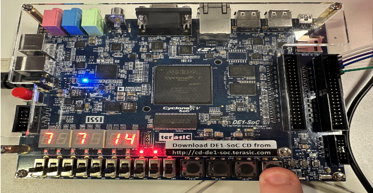
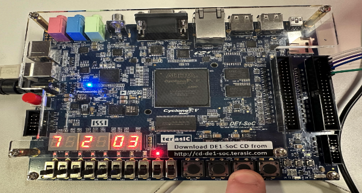
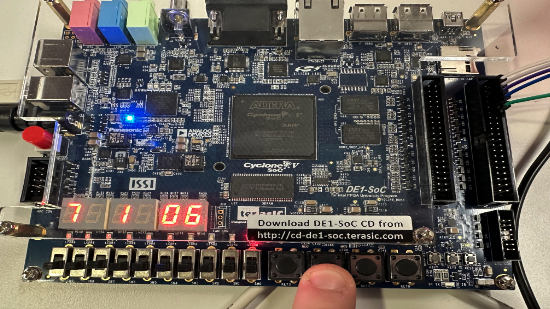
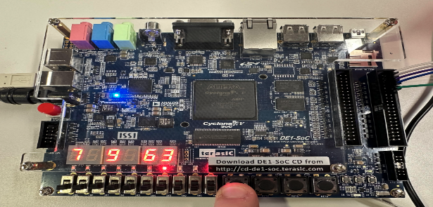

# NN-Digit-Recognition-with-FPGA-Displaying-Output
Camera Input image for digit recognition to DE1_SOC Fpga which displays outputs and has arithmetic functionality.

## Materials Required
* DE-1 SOC FPGA
* Arduino Due
* Python (OpenCV, Tensorflow, Keras)
* Arduino IDE

## System Diagram

## Brief Description     
* SerialCommforFPGA.ino
  * Establishes GPIO Pins (Any 4 work) (Ground between Arduino and FPGA is needed)
  * Opens up serial port and continuously loops
  * Searches for any inputs from Serial
  * Recieves digit input (1-9)
  * Turns digit into binary 4-bit (xxxx)
  * Writes high or low to corresponding GPIO Pins to mimic 4-bit
* NN7Seg.v
  * Establishes top level module
  * Establishes which 4-bit corresponds to which 7-seg display
  * Reads from GPIO pins, sets HEX3 to value
  * On Reset ON, 0 for all
  * On Reset Off, shift HEX3 value to HEX5 and store it there
  * LEDs to display binary 4-bit input on FPGA
 
    
## To run program
* python mnist.py
  * Writes MNIST dataset through CNN into a h.5 file and saves model
* python camera.py
  * Starts up camera through OpenCV and then you can display a digit in frame
  * Next press "Q" on keyboard to select an ROI that will be saved
  * Image is sent through keras.model.predict() to get a prediction of what digit was presented to Arduino
* SerialCommforFPGA.ino
  * Adjust COM port and Baud rate
  * Upload to Arduino
  * IF USING ANOTHER MICROCONTROLLER
     * Adjust Pinouts for GPIOs    
* NN7Seg.v
  * Compile and program board
  * Connect GPIO Pins from Arudino to Pins 2/4/6/8 and GND (12) on FPGA GPIO1
  * Run Python Script to send first digit
  * First digit will be displayed on HEX3
  * Switch reset ON then OFF to shift and store value
  * Run Python Script to send second digit
  * Second digit is displayed on HEX5
  * To perform Arthimetic (KEY3/KEY2/KEY1/KEY0)
  * IF USING DIFFERENT FPGA BOARD
     * Adjust all Pin Assignments
     * Adjust GPIO Pinouts
   

 
## FPGA Interaction
Arithmetic Functionality on FPGA Board through buttons
### Addition 

### Division

### Subtraction

### Multiplication

